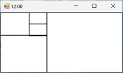

# NerdClock
The NerdClock came from a discussion with a PhD student who had seen one on the web so I decided to write one because 'Why not'. The interface uses the Fibonacci series to show the time. While not a reader of the Guardian or Medium, I did find an articles about the principle [there](https://www.theguardian.com/science/alexs-adventures-in-numberland/2015/may/09/fibonacci-clock-can-you-tell-the-time-on-the-worlds-most-stylish-nerd-timepiece) and [there](https://medium.com/@shubhamk008/fibonacci-clock-the-geeks-clock-finally-decoded-54f5ef50649a) plus a website that at one time sold a kit to make a [Fibonacci Clock](https://mathsgear.co.uk/products/fibonacci-clock) that has a YouTube video.

## How it works

The Fibonacci series is 0, 1, 1, 2, 3, 5, 8,... with the next number made by adding the last two together. The values 1 to 5 are used to divide up the interface into blocks of the same proportions: the total area is 12 (1 + 1+ 2 + 3 + 5), so the value 1 is 1/12th of the interface while the value 5 is 5 /12th of the interface (Figure 1). 

## Getting the Hour

This allows the clock to show the time in a 12 hour time format, so for: 
12:00 is shown by the interface being drawn in white, 
1:00 is shown by colouring one of the '1' rectangles in ```Blue```, [Figure 3](images/figure3.jpg)
2:00 has the two rectangle in ```Blue```, [Figure 4](images/figure4.jpg)
while 6:00 has both 1s, the 2 and the 3 in ```Blue```.[Figure 5](images/figure5.jpg)

So far so good!

## Getting the Minute

The minutes work in the same way, but since the clock is limited to 12 intervals, it means the clock only tells the time in blocks of five minutes.  
Just like the hours the blocks are colour coded, this time using ``Red`` to signify the minute, so for:   
0:00 to 0:04 the interface is solid ```White```,  
0:05 to 0:09 one of the '1' rectangles is ```Red```,[Figure 6](images/figure6.jpg)
0:10 to 0:14 the '2' is ```Red```,[Figure 7](images/figure7.jpg)
and for 0:30 to 0:34 one '1',  and the '5' in ``Red``.[Figure 8](images/figure8.jpg)

## Getting the time for more involved times

So far the time has been either all hours and no minutes or all minutes and no hours, when the time consists of a mix of minutes and hours, the rectangles are drawn as above except when a rectangle is used for both hours and minutes it is coloured ```Green```, so for 
12:00 to 12:04 it is all white
01:05 to 01:09 one of the '1' rectangles is ```Blue``` and the other is in ```Red```,[Figure 9](images/figure9.jpg)
02:35 to 02:39, the minutes are the 2 + 5 rectangle  ((2 + 5) * 5) to give 35 to 39 minutes and the hour is a single 2 recatngle. Since the 2 rectangle is used twice it is ```Green```, while the 5 rectangle is used just once for the minutes and so is ```Red```.[Figure 9](images/figure9.jpg)
 
